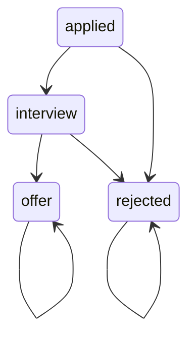

# Job Tracker – Full-Stack Dockerized Application

A full-stack job application tracking system built with **Django REST Framework** and **React (Vite)**.  
This project demonstrates real-world backend–frontend integration, authentication, backend-enforced business rules, and a fully Dockerized development workflow.


---

## ✨ Features

- 🔐 JWT-based authentication
- 📄 Create, update, and delete job applications
- 🔁 Backend-enforced job status workflow (state machine)
- 🔍 Server-side search and ordering
- ⚡ Debounced search for improved user experience
- 🐳 Fully Dockerized frontend, backend, and database

---

## 🏗 Tech Stack

### Backend
- Python 3.11
- Django 5
- Django REST Framework
- MySQL 8
- JWT Authentication

### Frontend
- React
- Vite
- JavaScript
- Fetch API

### Infrastructure
- Docker
- Docker Compose
- Vite proxy for API forwarding

---

## 📦 Project Structure

```text
djangoProject/
├── backend/
│   ├── docker-compose.yml
│   ├── Dockerfile
│   ├── manage.py
│   └── jobtracker/
│       └── settings.py
│
├── frontend/
│   ├── Dockerfile
│   ├── vite.config.js
│   └── src/
│       ├── api.js
│       ├── Jobs.jsx
│       └── Login.jsx
```

---

## 🔁 Job Application Workflow (Core Design)

Job applications follow a **strict backend-controlled workflow**.  
The workflow is implemented as a **state machine in the Django model**, not as free-form frontend state.

### Workflow Overview

```text
applied → interview → offer
       ↘ rejected
```

### Workflow Rules

- Every job starts in `applied`
- From `applied`, a job can transition to:
  - `interview`
  - `rejected`
- From `interview`, a job can transition to:
  - `offer`
  - `rejected`
- `offer` and `rejected` are terminal states
- Terminal states cannot transition to any other state
- All invalid transitions are rejected server-side

### State Diagram



### Backend Enforcement

- Transition rules are defined in the Django model
- A dedicated `POST /api/jobs/{id}/transition/` endpoint handles state changes
- Direct status updates that violate the workflow are blocked
- Business rules are enforced even if the frontend is bypassed

---

## 🔐 Authentication

- JWT tokens are issued by the backend
- Tokens are stored client-side
- All protected API endpoints require authentication
- Unauthorized requests return HTTP 401

---

## 🔍 Search & Ordering

- Implemented server-side using Django REST Framework filters
- Searchable fields:
  - `company`
  - `title`
  - `note`
- Orderable fields:
  - `created_at`
  - `updated_at`
  - `applied_at`
  - `status`

---

## ⚡ Debounced Search (Frontend)

- Search requests are debounced by 150ms
- Prevents excessive API calls while typing
- Improves perceived responsiveness
- Reduces backend load

---

## 🐳 Dockerized Architecture

All components run as Docker services via Docker Compose:

- **db** – MySQL database
- **web** – Django REST API
- **frontend** – React + Vite dev server

Frontend requests to `/api/*` are proxied to the backend container.

---

## 🚀 Getting Started (Development)

### Prerequisites

- Docker
- Docker Compose

---

### Start the Application

From the **backend directory**:

```bash
docker compose up
```

This starts:
- MySQL database
- Django backend (`http://localhost:8000`)
- React frontend (`http://localhost:5173`)

---

### Create a User (First Run Only)

```bash
docker compose exec web python manage.py createsuperuser
```

Use this account to log in via the frontend.

---

## 🌐 Access Points

| Service | URL |
|------|-----|
| Frontend | http://localhost:5173 |
| Backend API | http://localhost:8000 |
| Django Admin | http://localhost:8000/admin |

---

## 🔧 Development Notes

- Backend enforces permissions and workflow rules
- Frontend does not bypass business logic
- Docker volumes persist database data
- Container hostnames are handled via `ALLOWED_HOSTS`

---

## 🛑 Stopping the Application

Stop services:

```bash
docker compose down
```

Stop services and remove database data:

```bash
docker compose down -v
```

---

## 📌 Future Improvements

- Pagination for job listings
- Production frontend build with Nginx
- CI pipeline using GitHub Actions
- Automated tests

---

## 📄 License

This project is for learning only